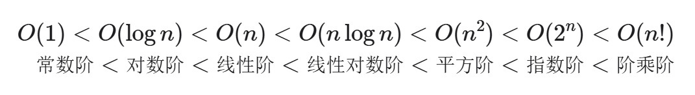
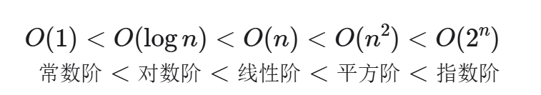

### 时间复杂度
·推算方法：
1、统计操作数量
    a.忽略常数项
    b.省略所有系数
    c.循环嵌套时使用乘法
2、逐渐渐近上界

·常见类型：

### 空间复杂度
算法相关空间：
    输入空间、暂存空间、输出空间
    暂存空间：暂存数据、栈帧空间、指令空间

最差空间复杂度
常见类型：

# 数据结构
## 数据结构分类
### 逻辑结构：线性与非线性
线性：数组、链表、栈、队列、哈希表
非线性：树、堆、图、哈希表；非线性还可进一步划分为树形、网状；
### 物理结构：连续与分散
所有数据结构都是基于数组、链表或者二者组合实现。
基于数组：栈、队列、哈希表、树、堆、图、矩阵、张量（维度≥3的数组）；
基于链表：栈、队列、哈希表、树、堆、图

## 基本数据类型：基于CPU可以直接进行运算
整数类型：byte、short、int、long
浮点数：folat、double
字符类型：char
布尔类型：bool

## 数组编码
### 原码、反码、补码
原码：最高位是符号位
反码：正数相同、负数是除符号位外所有位取反
补码：正数相同，负数是在反码基础上+1

# 数组与链表
## 数组：线性结构，存储在连续内存中

